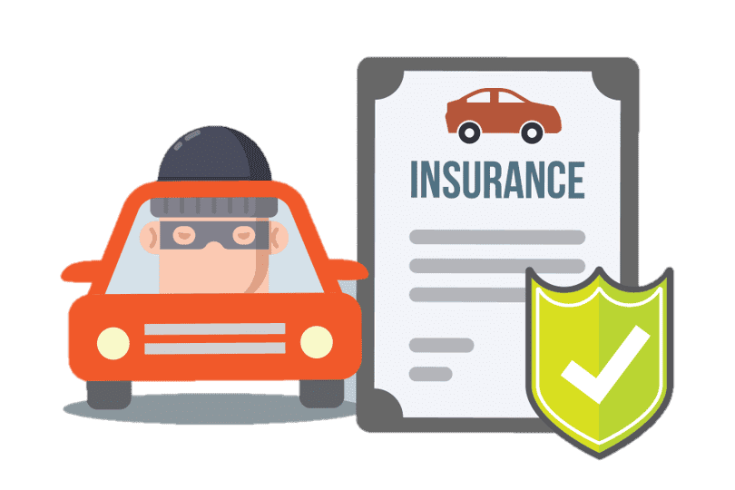
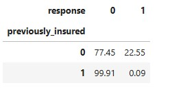
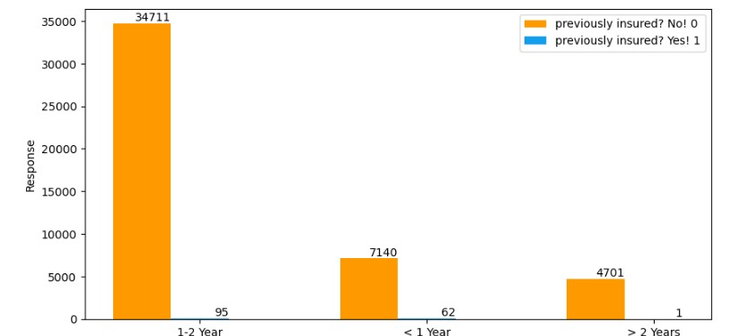
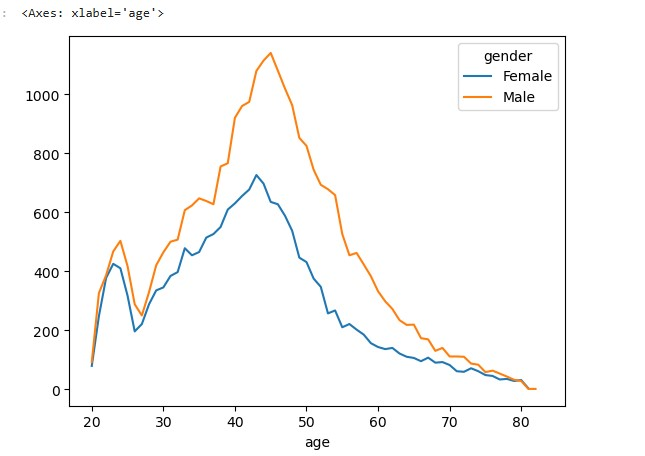
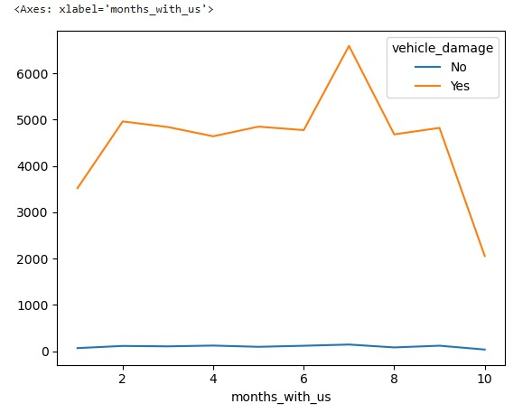
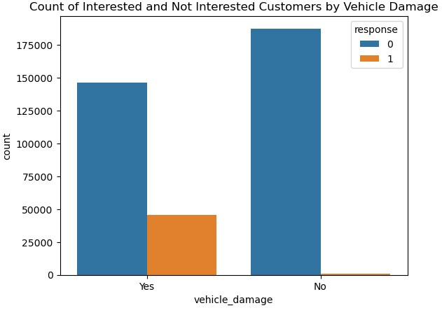
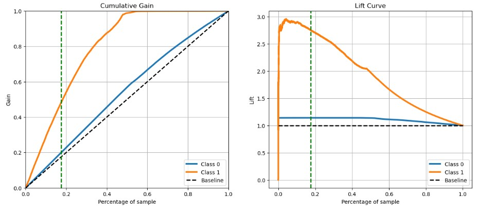
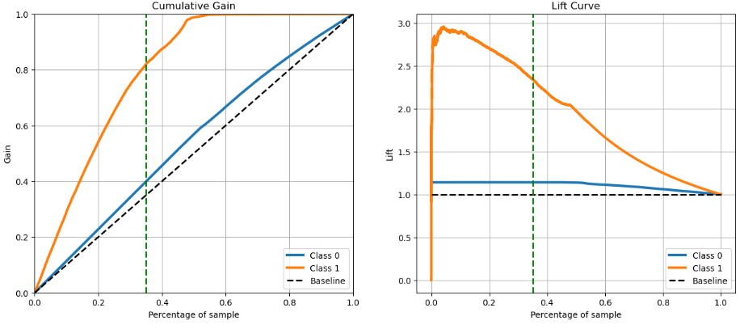

# Venda Cruzada de Seguro de Automóveis (Health Insurance Cross-Sell)

Este é um projeto que os dados se encontram no [Kaggle](https://www.kaggle.com/datasets/anmolkumar/health-insurance-cross-sell-prediction)
Este portfólio está seguindo as recomendações do curso Ciência de Dados da Comunidade DS.

O notebook com todos os passos realizados está disponivel [aqui](https://github.com/antonioorichard/health-insurance--cross-sell/blob/main/notebooks/PA4_END.ipynb). O google sheets com os produtos de dados em produção pode ser acessado clicando aqui[https://docs.google.com/spreadsheets/d/1or_372MebG0tmsrva8uBBHRsfpgAK7IqcIkXhy16Klw/edit?gid=0#gid=0]. Ao enviar uma mensagem para o BOT, a resposta pode haver uma lentidão para aparecer, pois, o Render depois de um tempo sem uso desliga a aplicação.

### Este projeto foi feito por *Antonio Richard*.

## This project aims to order a potential client list by propensity score

# 1. Problema de negócio

A Insurance All é uma empresa que fornece seguro de saúde para seus clientes e o time de produtos está analisando a possibilidade de oferecer aos assegurados, um novo produto: Um seguro de automóveis.

Assim como o seguro de saúde, os clientes desse novo plano de seguro de automóveis precisam pagar um valor anualmente à Insurance All para obter um valor assegurado pela empresa, destinado aos custos de um eventual acidente ou dano ao veículo.

A Insurance All fez uma pesquisa com cerca de 380 mil clientes sobre o interesse em aderir a um novo produto de seguro de automóveis. Esses clientes do conjunto pesquisa manifestaram sua opinião de duas formas "interessado" e "não interessado" em adquirir o seguro de automóvel, então essas respostas ficaram salvas em um banco de dados junto a outros atributos dos clientes.

O time de produtos selecionou 127 mil novos clientes que não responderam a pesquisa para participar de uma campanha, no qual receberão a oferta do novo produto de seguro de automóveis. A oferta será feita pelo time de vendas através de ligações telefônicas.

Contudo, o time de vendas tem uma capacidade de realizar 20 mil ligações dentro do período da campanha.

Nesse contexto, eu fui contratado como um consultor de Ciência de Dados para construir um modelo que prediz se o cliente estaria ou não interessado no seguro de automóvel. 

Com essa solução, o time de vendas espera conseguir priorizar as pessoas com maior interesse no novo produto e assim, otimizar a campanha realizando apenas contatos aos clientes mais propensos a realizar a compra.

Como resultado da consultoria, é necessário entregar um relatório contendo algumas análises e respostas às seguintes perguntas:

1. Principais Insights sobre os atributos mais relevantes de clientes interessados em adquirir um seguro de automóvel.

2. Qual a porcentagem de clientes interessados em adquirir um seguro de automóvel, o time de vendas conseguirá contatar fazendo 20.000 ligações?

3. E se a capacidade do time de vendas aumentar para 40.000 ligações, qual a porcentagem de clientes interessados em adquirir um seguro de automóvel o time de vendas conseguirá contatar?

4. Quantas ligações o time de vendas precisa fazer para contatar 80% dos clientes interessados em adquirir um seguro de automóvel?

# 2. Premissas de Negócios

Cada linha representa um cliente e cada coluna contém alguns atributos que descrevem esse cliente, além da sua resposta à pesquisa, na qual ela mencionou "interesse" ou "não interesse" ao novo produto de seguros. 

Os atributos sobre os clientes são:
Variável | Definição
------------ | -------------
|Id| Identificador único do cliente.|
|Gender| Gênero do cliente.|
|Age| Idade do cliente.|
|Driving License| 0, o cliente não tem permissão para dirigir e 1, o cliente tem para dirigir ( CNH – Carteira Nacional de Habilitação )|
|Region Code| Código da região do cliente.|
|Previously Insured| 0, o cliente não tem seguro de automóvel e 1, o cliente já tem seguro de automóvel.|
|Vehicle Age| Idade do veículo.|
|Vehicle Damage| 0, cliente nunca teve seu veículo danificado no passado e 1, cliente já teve seu veículo danificado no passado.|
|Anual Premium| Quantidade que o cliente pagou à empresa pelo seguro de saúde anual.|
|Policy sales channel| código anônimo para o canal de contato com o cliente.|
|Vintage| número de dias que o cliente se associou à empresa através da compra do seguro de saúde.|
|Response| 0, o cliente não tem interesse e 1, o cliente tem interesse.|

# 3. Estratégia de solução

Para conseguir o resultado da pesquisa no [google sheets](https://docs.google.com/spreadsheets/d/1or_372MebG0tmsrva8uBBHRsfpgAK7IqcIkXhy16Klw/edit?gid=0#gid=0) e ordenar a lista de clientes com maior probabilidade de adquirir um seguro, foi feita as etapas descrita abaixo:

**Step 01. Descrição dos Dados:**

Etapa onde foi renomeado as variaveis para o padrão onde os espaços são substituídos por underline(_) e todas as palavras são em letra minúscula. Também verificou-se a quantidade de linhas e colunas do dataset e o seu tipo de dados

**Step 02. Engenharia de Atributo**

Nessa etapa as respostas dos atributos "vehicle age" foram alteradas com one_hot_enconde e as respostas do atributo "vehicle damage" também foram alteradas: os originais "Yes" e "No" por 1 e 0, respectivamente.

**Step 03. Filtragem dos Dados:**

Nessa etapa ocorre a manipulação dos valores ausentes e autliers, nesse conjunto de dados não foi encontrado valores ausentes, por essa razão essa etapa não foi feita.

**Step 04. Análise exploratória de dados:**

Nessa etapa foram realizadas as análises específicas para entender a influência de algumas características na decisão final do cliente em adquirir um seguro. Entre os principais insights:

	1. Clientes que tem entre 40 até 50 anos são os que mais manifestaram interesse.

	2. Homens são que mais manifestaram interesse.

	3. Donos de carros com a idade entre 1 a 2 anos, são os mais manifestaram interesse.

	4. Os clientes que estão na empresa entre 6 a 8 os meses são que os que mais se interessaram.

	5. Os clientes que possuir carros com histórico de batidas, mais se manifestam interessados.	

**Step 05. Preparação dos dados:**

Nessa etapa foi feita a padronização, transformação dos dados e reescala.

**Step 06. Seleção de variaveis:**

Nessa etapa foi feita a identificação das variaveis mais importantes para o treinamento do modelo de aprendizado de máquina. Para isso, foi utilizado o pacote de correlação e o modelo Random Forest para selecionar os atributos, contudo, como a quantidade era pouca, somente o id não foi usado.

**Step 07. Machine Learning Modelling:**

Nessa etapa é utilizada para avaliar e testar os algoritmos de aprendizado de máquina, os classificadores foram Logistic Regression, Random Forest, Catboost.

**Step 08. Performasse do modelo:**

Nessa etapa é verificada a performance de cada modelo criado e foi escolhido o modelo Logistic Regression, visto ter uma performance próxima dos demais e possuir menor tamanho, isso diminui o tempo de resposta e espaço no deploy, podendo economizar custo para empresa, na etapa de Hyperparameter foi pulada, visto que o modelo pela configuração escolhida atingiu uma resposta satisfatória para o problema e como o conjunto de dado eram, tendo um resultado em menor tempo.

~**Step 09. Hyperparameter Fine Tuning:**~

**Step 10. Converter o modelo em valores de negócios:**

O gerente recebeu uma lista ordenada de clientes com maior probabilidade de adquirir um seguro de veículo. Ao entrar em contato com os 40% da lista ordenada pelo algoritmo espera-se que haja uma conversão de pelo menos 90% do total de interessados no produto.

**Step 11. Deploy Model to Production:**

# 4. Modelos de Machine Learning

Nessa etapa é utilizada para avaliar e testar os algoritmos de aprendizado de máquina os classificadores Logistic Regression, Random Forest, Catboost.

# 5. Performance do Modelo de Machine Learning
A performance de cada modelo escolhido está na tabela abaixo usando a Accuracia, precisão e recall com as suas medias e desvios padrão. O @k representa os dados de 20 mil ligações.

|Model Name	|Accuracy Mean	| Accuracy STD| Precision Mean	|Precision STD	|Recall Mean	|Recall STD	|Precision@K Mean	|Precision@K STD	|Recall@K Mean	|Recall@K STD|
|:-------| :----------:	| :---------:| :--------: | :---------:| :---------: | :-------: | :-------: | :--------: | :----------:| :----------:|
|LogisticRegression	|0.8779|0.00  |0.1143 |0.2286	|0.0001	|0.0002	|0.2761 |0.0009	|0.8481	|0.0027|
|RandomForestClassifier	|0.8780|0.00  |0.3333 |0.2789	|0.0002	|0.0001	|0.2899	|0.0009 |0.8906	|0.0029|
|CatboostClassifier	|0.8780|0.00  |0.0000 |0.0000	|0.0000	|0.0000	|0.2890	|0.0009	|0.8877	|0.0027|

# 6. Business Results
Agora será mostrado o relatório com as análises e responder as perguntas de negocios.

## 1. Principais Insights sobre os atributos mais relevantes de clientes interessados em adquirir seguro de automóvel.

**Hypothesis 01:**
Clientes que possuem carro novo de até 2 anos e já tiveram seguro vão querer fazer seguro com a gente, mais do que aqueles que não tiveram ainda.

**False**

Pois como pode ser observado na tabela (01):

Clientes que não contrataram seguro antes vão querer muito mais que aqueles que já tinha seguro, e ainda pelo (gráfico 01)![gráfico (01)]

observa não só isso, mas também que os donos dos carros com idade entre 1 a 2 anos são os que mais demostraram interessados.

**Hypothesis 02:**

Clientes com carros mais novos ou com idade menor do que um ano, contratam mais seguro
**FALSE**

Observando a imagem do gráfico 01 e 02:

Os clientes com carro de 1 até 2 anos são que mais contratam mais!

**Hypothesis 03:**

Clientes que tem entre 40 anos e 50 anos com carro de idade até 2 ano, são que mais contratar o seguro
**True**

Principalmente com carros de 1 até 2

Insight de negócio: Buscar dados de acionamento de seguro por clientes com faixa de idade entre 40 a 50 com veículos de 1 a 2 anos, a fim de validar esta possível correlação. Havendo correlação, avaliar necessidade de reajustes no preço dos seguros ofertados a estes clientes.

**Hypothesis 04:**

Mulheres contratam mais seguro do que homens

**False**

Geralmente homens contratam mais o seguro do que as mulheres!

**Hypothesis 05:**

Clientes que estão a mais tempo conosco e já sofreram acidentes são o que mais vão querer contratar.
**False**

o que mais contrataram foram 6 a 8 meses como cliente. Entretanto, quem já sofreu algum acidente são os que mais contrataram o seguro

## 2. Qual a porcentagem de clientes interessados em adquirir um seguro de automóvel, o time de vendas conseguirá contatar fazendo 20.000 ligações?

Com 20.000 ligações o time de vendas terá ligado para cerca de 17,49% da base de clientes, podendo contatar aproximadamente 50% dos clientes que estão interessados em um seguro de automóveis.

## 3. E se a capacidade do time de vendas aumentar para 40.000 ligações, qual a porcentagem de clientes interessados em adquirir um seguro de automóvel o time de vendas conseguirá contatar?

Com 40.000 ligações o time de vendas terá ligado para 34,98% da base de clientes e dessa teria 
encontrado cerca de 80% dos clientes que estão interessados em um seguro de automóveis.

## 4. Quantas ligações o time de vendas precisa fazer para contatar 80% dos clientes interessados em adquirir um seguro de automóvel?

Com no mínimo 38422 ligações contatariam cerca de 79,96% ou 80% dos interessados.

# 7. Conclusão

De acordo com os critérios definidos, foi feita uma lista de clientes com o maior interesse em adquirir um seguro de automóveis. Como resultado para o negócio foram criados:

* Uma API onde será feita a previsão dos clientes com o maior interesse.

* Uma planilha no google sheets que mostrar em porcentagem a chances desses clientes com interesse em adquirir um seguro de automóveis.

Abaixo mostra como usar o google sheets para fazer a previsão de clientes.

# 8. Próximos passos

Algumas melhorias no projeto podem ser incrementadas no futuro:

* Colocar as classes das linhas do gráfico e a porcentagem
* Testes novos modelos e fazer o balanceamento de classe para melhorar a performance do modelo
* No google sheets poder fazer a previsão selecionando as linhas
* Fazer uma validação no google sheets, pois da forma que está aparece um erro se não for colocado os dados corretamente.
